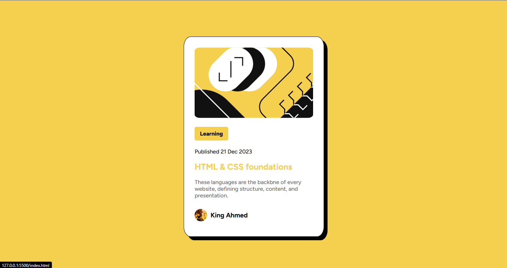
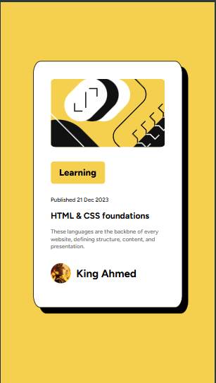
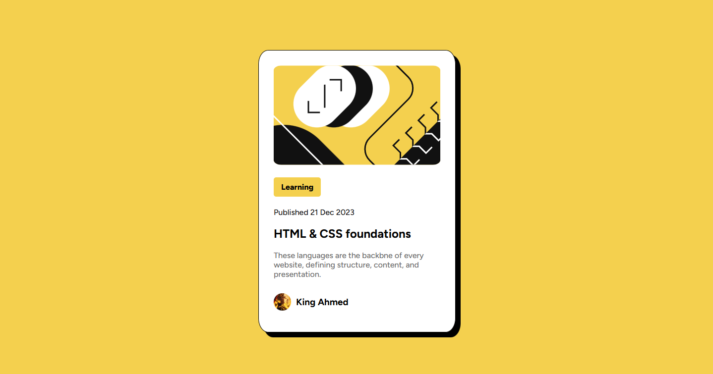

# Frontend Mentor - Blog preview card solution

This is a solution to the [Blog preview card challenge on Frontend Mentor](https://www.frontendmentor.io/challenges/blog-preview-card-ckPaj01IcS). Frontend Mentor challenges help you improve your coding skills by building realistic projects. 

## Table of contents

- [Overview](#overview)
  - [The challenge](#the-challenge)
  - [Screenshot](#screenshot)
  - [Links](#links)
- [My process](#my-process)
  - [Built with](#built-with)
  - [What I learned](#what-i-learned)
  - [Useful resources](#useful-resources)
- [Author](#author)

**Note: Delete this note and update the table of contents based on what sections you keep.**

## Overview

### The challenge

Users should be able to:

- See hover and focus states for all interactive elements on the page

### Screenshot






### Links

- Solution URL: [Solution](https://www.frontendmentor.io/solutions/responsive-blog-preview-card-with-flexbox-vSi0QZwxdQ)
- Live Site URL: [Live Site](https://ahmed-adjei1.github.io/Blog-Preview-Card/)

## My process

### Built with

- Semantic HTML5 markup
- CSS custom properties
- Flexbox
- Desktop-first workflow

### What I learned

- How to make responsive font sizes without media query.
- How to make a shadow.

```.container {
  box-shadow: 10px 10px;
}```

```p {
    /* font size renders with regards to viewport width */
  font-size: clamp(10px, 2.5vw, 16px);
}```


### Useful resources

- [Example resource 1](https://www.w3schools.com/cssref/func_clamp.php) - This helped me with making responsive font size without media query and how to create a shadow.

## Author

- Frontend Mentor - [@Ahmed-Adjei](https://www.frontendmentor.io/profile/Ahmed-Adjei1)
- Twitter - [@King Ahmed](https://x.com/KingAhm92896393)

**Note: Delete this note and add/remove/edit lines above based on what links you'd like to share.**
